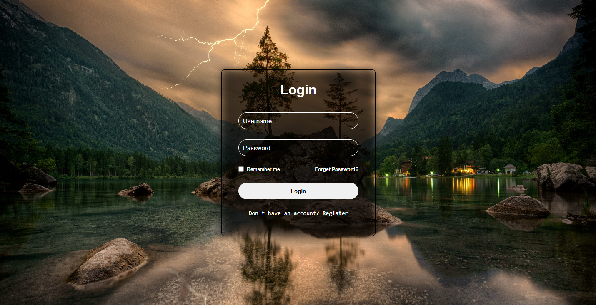
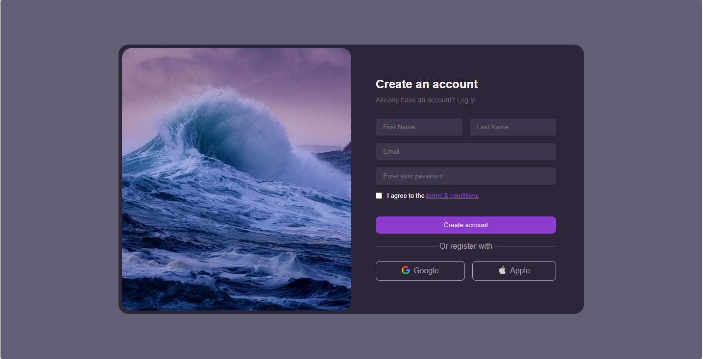
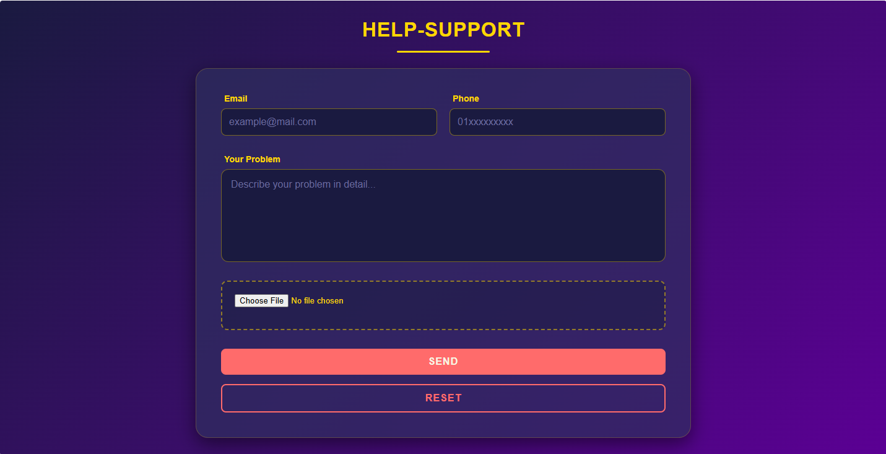
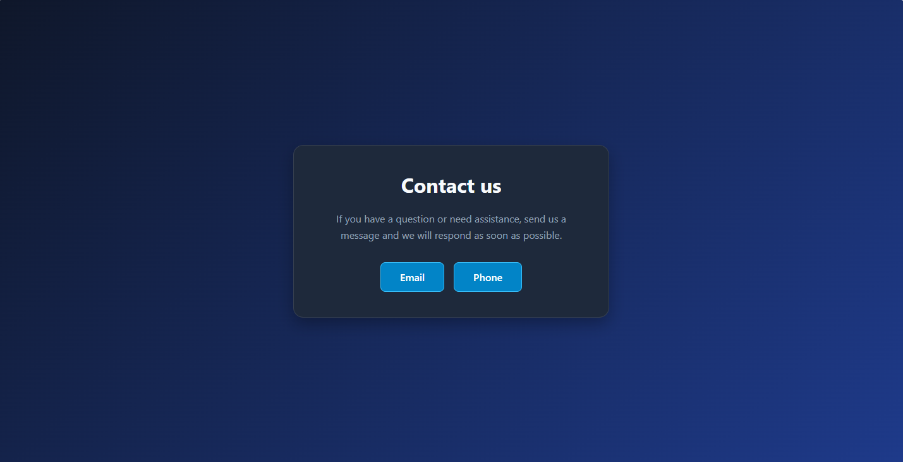

# 🎓 IP Project - ElTeacher

Welcome to the **ElTeacher IP Project** repository. This project demonstrates a complete Front-End Web Design comprising multiple interactive pages with a modern, responsive user interface.

## 🔗 Live Demo
Check out the live version here:  
👉 **[Click Here to View Live Demo](https://omart-hub.github.io/ip-project-ElTeacher/)**

---

## 📝 Project Description
This project is designed to showcase advanced HTML5 and CSS3 techniques. It features a cohesive dark theme with gold and pink accents, utilizing modern layout modules like **Flexbox** to ensure responsiveness across different devices.

### Key Features:
* **Modern UI/UX:** Glassmorphism effects, linear gradients, and custom form controls.
* **Clean Architecture:** CSS files are organized by page, with a `master.css` for global styles.
* **Interactive Elements:** Custom hover effects on buttons and inputs.

---

## 📸 Project Gallery
A tour of the application pages:

| **Home Page** | **Login Page** |
| :---: | :---: |
|  |  |

| **Sign Up** | **Help & Support** |
| :---: | :---: |
|  |  |

| **Contact Us** |
| :---: |
|  |

---

## 📂 File Structure
The project is organized as follows:

```text
IP-Project/
│
├── 📄 index.html          # Main Home Page
├── 📄 login-page.html     # User Login Interface
├── 📄 sign-up.html        # New User Registration
├── 📄 help.html           # Help & Support Form
├── 📄 contact.html        # Contact Us Page
│
├── 📂 css/                # Stylesheets
│   ├── master.css         # Global variables & main styles
│   ├── login.css          # Login page specific styles
│   ├── signup.css         # Signup page specific styles
│   ├── help.css           # Help page specific styles
│   └── contact.css        # Contact page specific styles
│
└── 📂 images/             # Assets
    ├── background/        # Background images
    ├── icon/              # Icons and Favicons
    └── screenshots/       # Project screenshots for README